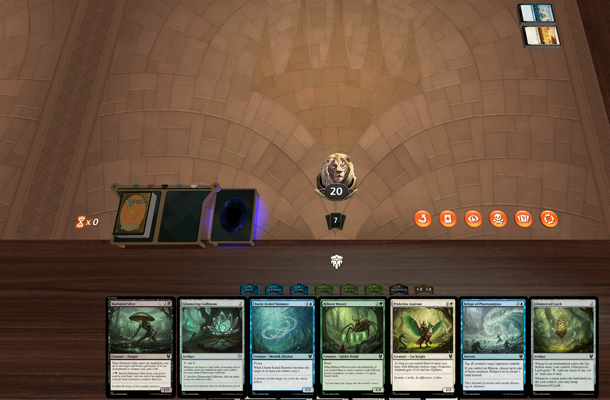

# MTG Card Generator

Generate complete Magic: The Gathering card sets using AI, including card mechanics, flavor text, and artwork. The generator creates thematically cohesive sets with synergistic mechanics based on randomly generated themes or your own custom themes.

## Features

- **Theme Options**: Either generate unique, cohesive themes automatically or provide your own complete theme override.
- **Card Generation**: Generates complete cards including:
  - Card names and mana costs
  - Card types and abilities
  - Power/toughness for creatures
  - Flavor text
  - Rarity distribution
  - Color balance
- **Art Generation**: Creates unique artwork for each card using AI.
  - Supports Replicate API (default).
  - **New:** Supports local image generation via Hugging Face `diffusers` library (requires local setup and powerful GPU).
- **Language Model Integration**:
  - Uses OpenRouter API for card text, theme, and JSON conversion (default).
  - **New:** Supports local language model interaction via Ollama (requires local Ollama setup and downloaded models).
- **Card Rendering**: Renders cards in the official MTG card frame style.
- **Format Support**: Outputs cards in both JSON and PNG formats.
- **Tabletop Simulator Support**: Convert card images into properly formatted deck sheets for Tabletop Simulator.
- **Booster Draft Generator**: Create draft boosters with the correct card distribution for play in Tabletop Simulator.

## Generated example Cards

Here are some examples of cards generated by the system:


## Prerequisites

- Python 3.8+
- Node.js (for running the card renderer)
- A modern web browser
- API keys (required):
  - OpenRouter API key (for card generation)
    - Sign up at https://openrouter.ai/
    - Create an account and generate an API key
    - This is used for generating card mechanics, flavor text, and converting card formats
  - Replicate API key (for art generation)
    - Sign up at https://replicate.com/
    - Create an account and generate an API key from your account settings
    - This is used for generating unique artwork for each card using AI models
  - **(Optional) Hugging Face Diffusers**: For local image generation.
    - No API key needed, but requires a local environment with `diffusers`, `torch`, and compatible GPU.
    - See `card-generator/tools/huggingface_diffusers_tool.py` for more details.
  - **(Optional) Ollama**: For local language model usage.
    - No API key needed, but requires a local Ollama installation and downloaded models (e.g., Llama 2, Mistral).
    - See `card-generator/tools/ollama_tool.py` for more details.
    - Ollama website: https://ollama.com/
  
Note: OpenRouter and Replicate APIs require credit card information and have associated costs.
- OpenRouter charges based on the number of tokens processed.
- Replicate charges based on the number of images generated.

Using local models via Hugging Face Diffusers and Ollama can be free alternatives (after initial hardware setup for Diffusers) but may require significant local compute resources and technical setup. The project defaults to paid APIs for ease of use and potentially higher quality out-of-the-box.

## Installation

1. Clone the repository:
```bash
git clone https://github.com/yourusername/mtg-card-generator.git
cd mtg-card-generator
```

2. Create and activate a virtual environment:
```bash
# On Linux/Mac
python -m venv venv
source venv/bin/activate

# On Windows
python -m venv venv
venv\Scripts\activate
```

3. Install Python dependencies:
```bash
pip install -r requirements.txt
```

4. Install Playwright browser:
```bash
playwright install
```

5. Configure API keys:
```bash
# Copy the example settings file
cp card-generator/settings.example.json card-generator/settings.json

# Edit settings.json with your API keys
{
  "openrouter": {
    "apiKey": "your_openrouter_api_key"
  },
  "replicate": {
    "apiKey": "your_replicate_api_key"
  }
}
```

## Usage

1. Start the card generation process:
```bash
cd card-generator
python main.py
```

This will:
- Generate a random set theme (or use your provided theme)
- Create cards with balanced colors and rarities
- Generate art for each card
- Convert cards to the proper rendering format
- Render cards as images

2. The generated content will be in the `output` directory:
- `mtg_set_output.json`: Raw card data
- `mtg_set_complete.json`: Complete set data with statistics
- `render_format/`: Cards formatted for rendering in `card-rendering/index.html`
- `card_images/`: Final rendered card images

3. To manually render individual cards:
```bash
cd card-rendering
# Open index.html in a web browser
```

## Configuration

You can modify the generation parameters in `card-generator/main.py` or by editing `card-generator/settings.json` for some model choices.

**Primary Configuration (`card-generator/main.py`):**

```python
config = Config(
    inspiration_cards_count=50,  # Number of cards to use as inspiration
    batches_count=1,            # Number of batches to generate
    
    # Theme options (choose one):
    theme_prompt="Warhammer Fantasy",  # Provides a hint for theme generation
    # OR
    complete_theme_override="Your complete custom theme text here...",  # Use this for a fully custom theme
    
    # Rarity distribution
    mythics_per_batch=1,        # Mythic rares per batch
    rares_per_batch=1,          # Rares per batch
    uncommons_per_batch=1,      # Uncommons per batch
    commons_per_batch=1,        # Commons per batch
    
    # Color distribution
    color_distribution={        # Target color distribution
        "W": 0.2,  # White
        "U": 0.2,  # Blue
        "B": 0.2,  # Black
        "R": 0.2,  # Red
        "G": 0.2   # Green
    },

    # Image generation model (options: "replicate", "flux", "imagen", "diffusers")
    # "replicate" is the original default. "flux" and "imagen" are specific Replicate models.
    # "diffusers" will use the HuggingFaceDiffusersTool.
    # Ensure your settings.json is configured if using "replicate", "flux", or "imagen".
    # For "diffusers", ensure your local environment is set up.
    image_model="replicate", # Default, or "flux", "imagen"

    # Language model for card text generation (main_model) and JSON conversion (json_model)
    # These usually point to models available via OpenRouter.
    # To use Ollama, you would need to modify the MTGSetGenerator and MTGJSONConverter
    # to use the OllamaTool, specifying a local model name.
    # This requires code changes beyond simple configuration.
    main_model="openai/gpt-4o", # Example OpenRouter model
    json_model="openai/gpt-4o-mini"  # Example OpenRouter model
)
```

**API and Local Model Settings (`card-generator/settings.json`):**

The `settings.json` file is used for API keys and can be extended for local model configurations if needed (though current tools are mostly configured in `main.py` or directly in their respective classes).

```json
{
  "openrouter": {
    "apiKey": "your_openrouter_api_key"
  },
  "replicate": {
    "apiKey": "your_replicate_api_key",
    "flux_model": "black-forest-labs/FLUX.1-schnell", // Optional: specific model for "flux"
    "imagen_model": "ai-forever/kandinsky-2.2"     // Optional: specific model for "imagen"
  },
  "huggingface_diffusers": {
    "model_id": "runwayml/stable-diffusion-v1-5", // Default model for HuggingFaceDiffusersTool
    "device": "cuda" // "cuda" or "cpu"
  },
  "ollama": {
    "host": null // e.g., "http://localhost:11434", null uses default
  }
}
```
*Note: The `image_model` setting in `main.py`'s `Config` object will determine which image generation path is taken. If set to `"diffusers"`, it will attempt to use the `HuggingFaceDiffusersTool`. The specific model ID for diffusers can be set in `settings.json` or passed during `HuggingFaceDiffusersTool` instantiation.*

*For Ollama, the `OllamaTool` can be used programmatically. Integrating it into the main card generation flow to replace OpenRouter would require modifications to `MTGSetGenerator` and other components to call `OllamaTool.generate_text()` with appropriate local model names.*


### Custom Theme Structure

When providing a `complete_theme_override`, your theme should include:

```
# Theme Title

## World Description
[Detailed description of the world/setting]

## Key Factions
[List and description of major factions/groups]

## Creature Types
[Common creature types in the set]

## Mechanical Themes
[Key gameplay mechanics and themes]

## Synergies
[How different card types and mechanics work together]

## Play Styles
[What play styles the set supports]
```

## Basic Land Generation

The system automatically generates variations of each basic land type:

- Plains, Island, Swamp, Mountain, and Forest
- Each type gets multiple artistic variations
- Land art is themed to match your set's aesthetic

You can configure:

- Whether to generate basic lands (`generate_basic_lands`)
- How many variations to create for each type (`land_variations_per_type`)

## Tabletop Simulator Integration

The project includes a TTS Deck Converter tool (`tts_deck_converter.py`) that arranges your generated card images into grid layouts compatible with Tabletop Simulator.

### TTS Converter Features

- Creates properly formatted card sheets for importing into Tabletop Simulator
- Automatically handles large sets by creating multiple sheets when needed
- Configurable grid dimensions, card sizes, and output quality
- Optional card sorting for easier organization

### Using the TTS Converter

```bash
cd card-generator
python tts_deck_converter.py
```

This will open a folder selector dialog. You can choose a directory containing your card images. The converter will then create a `tts_deck` folder with the following structure:

```
tts_deck/
├── deck_sheet_1.png
├── deck_sheet_2.png
├── deck_sheet_3.png
└── ...
```

Each sheet will contain a grid of card images, ready for import into Tabletop Simulator.

To import the deck sheets into Tabletop Simulator:

1. Open Tabletop Simulator
2. Create a new game
3. Click on "Objects" in the top menu
4. Select "Components" > "Cards" > "Custom Deck"
5. Select the first deck sheet image for front images
6. You can use `https://static.wikia.nocookie.net/mtgsalvation_gamepedia/images/f/f8/Magic_card_back.jpg/revision/latest` as the back image
7. Set the number of cards per row and column based on your grid size
8. Click "Import" to load the deck into your game
9. Repeat for each deck sheet

You can now play with your customer cards in tabletop simulator!



## Booster Draft Generator

The project includes a Booster Draft Generator that creates randomized booster packs from your generated sets for drafting in Tabletop Simulator.

### Using the Booster Generator

1. Launch the booster generator:
```bash
cd card-generator
python mtg-booster-generator.py
```

2. In the interface:
   - Select your MTG set folder
   - Set the number of boosters (1-100)
   - Click "Generate Boosters"

The generator creates:
- 15-card boosters with the correct rarity distribution (1 rare/mythic, 3 uncommons, 11 commons)
- Special boosters for each basic land type with all art variants
- All output saved in a `boosters` folder ready for use in Tabletop Simulator (see above for import instructions)

## Card Rendering Details

The card renderer supports:
- Standard MTG card frames
- Extended art frames
- Various card types (creatures, instants, sorceries, etc.)
- Multicolored cards
- Power/toughness boxes
- Set symbols
- Collector numbers
- Artist credits

## Acknowledgments

- Card rendering system based on [MTG Render](https://www.mtgrender.tk/) by Yoann 'Senryoku' Maret-Verdant
- Magic: The Gathering is a trademark of Wizards of the Coast LLC
- Card frame designs based on official MTG templates
- AI art generation powered by Replicate, Black Forest Labs, Stability AI (Stable Diffusion), and other models available via Hugging Face.
- Card generation powered by OpenRouter, OpenAI, and various models accessible via Ollama.

Special thanks to Yoann 'Senryoku' Maret-Verdant for creating the original MTG card renderer ([GitHub](https://github.com/Senryoku)) which forms the foundation of our card rendering system.