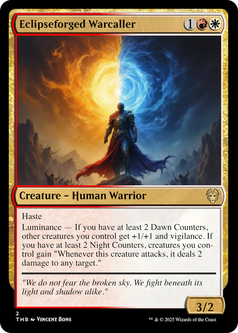
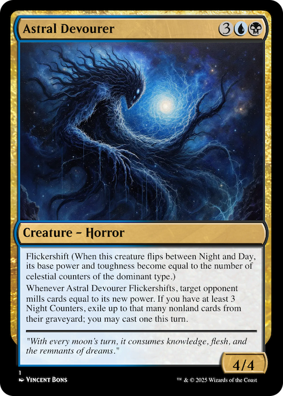

# MTG Card Generator

Generate complete Magic: The Gathering card sets using AI, including card mechanics, flavor text, and artwork. The generator creates thematically cohesive sets with synergistic mechanics based on randomly generated themes.

## Features

- **Theme Generation**: Creates unique, cohesive themes for Magic: The Gathering sets
- **Card Generation**: Generates complete cards including:
  - Card names and mana costs
  - Card types and abilities
  - Power/toughness for creatures
  - Flavor text
  - Rarity distribution
  - Color balance
- **Art Generation**: Creates unique artwork for each card using AI
- **Card Rendering**: Renders cards in the official MTG card frame style
- **Format Support**: Outputs cards in both JSON and PNG formats

## Generated example Cards

Here are some examples of cards generated by the system:





## Prerequisites

- Python 3.8+
- Node.js (for running the card renderer)
- A modern web browser
- API keys (required):
  - OpenRouter API key (for card generation)
    - Sign up at https://openrouter.ai/
    - Create an account and generate an API key
    - This is used for generating card mechanics, flavor text, and converting card formats
  - Replicate API key (for art generation)
    - Sign up at https://replicate.com/
    - Create an account and generate an API key from your account settings
    - This is used for generating unique artwork for each card using AI models
  
Note: Both APIs require credit card information and have associated costs. Make sure to review their pricing structures:
- OpenRouter charges based on the number of tokens processed
- Replicate charges based on the number of images generated

The project uses these paid APIs as they provide high-quality results for both card generation and artwork. There are no free alternatives that provide the same level of quality.

## Installation

1. Clone the repository:
```bash
git clone https://github.com/yourusername/mtg-card-generator.git
cd mtg-card-generator
```

2. Create and activate a virtual environment:
```bash
# On Linux/Mac
python -m venv venv
source venv/bin/activate

# On Windows
python -m venv venv
venv\Scripts\activate
```

3. Install Python dependencies:
```bash
pip install -r requirements.txt
```

4. Install Playwright browser:
```bash
playwright install
```

5. Configure API keys:
```bash
# Copy the example settings file
cp card-generator/settings.example.json card-generator/settings.json

# Edit settings.json with your API keys
{
  "openrouter": {
    "apiKey": "your_openrouter_api_key"
  },
  "replicate": {
    "apiKey": "your_replicate_api_key"
  }
}
```

## Usage

1. Start the card generation process:
```bash
cd card-generator
python main.py
```

This will:
- Generate a random set theme
- Create cards with balanced colors and rarities
- Generate art for each card
- Convert cards to the proper rendering format
- Render cards as images

2. The generated content will be in the `output` directory:
- `mtg_set_output.json`: Raw card data
- `mtg_set_complete.json`: Complete set data with statistics
- `render_format/`: Cards formatted for rendering in `card-rendering/index.html`
- `card_images/`: Final rendered card images

3. To manually render individual cards:
```bash
cd card-rendering
# Open index.html in a web browser
```

## Configuration

You can modify the generation parameters in `main.py`:

```python
config = Config(
    inspiration_cards_count=50,  # Number of cards to use as inspiration
    batches_count=1,            # Number of batches to generate
    cards_per_batch=4,          # Cards per batch
    mythics_per_batch=1,        # Mythic rares per batch
    rares_per_batch=1,          # Rares per batch
    uncommons_per_batch=1,      # Uncommons per batch
    commons_per_batch=1,        # Commons per batch
    color_distribution={        # Target color distribution
        "W": 0.2,  # White
        "U": 0.2,  # Blue
        "B": 0.2,  # Black
        "R": 0.2,  # Red
        "G": 0.2   # Green
    }
)
```

## Card Rendering Details

The card renderer supports:
- Standard MTG card frames
- Extended art frames
- Various card types (creatures, instants, sorceries, etc.)
- Multicolored cards
- Power/toughness boxes
- Set symbols
- Collector numbers
- Artist credits

## Acknowledgments

- Card rendering system based on [MTG Render](https://www.mtgrender.tk/) by Yoann 'Senryoku' Maret-Verdant
- Magic: The Gathering is a trademark of Wizards of the Coast LLC
- Card frame designs based on official MTG templates
- AI art generation powered by Replicate and Black Forest Labs
- Card generation powered by OpenRouter and OpenAI

Special thanks to Yoann 'Senryoku' Maret-Verdant for creating the original MTG card renderer ([GitHub](https://github.com/Senryoku)) which forms the foundation of our card rendering system.